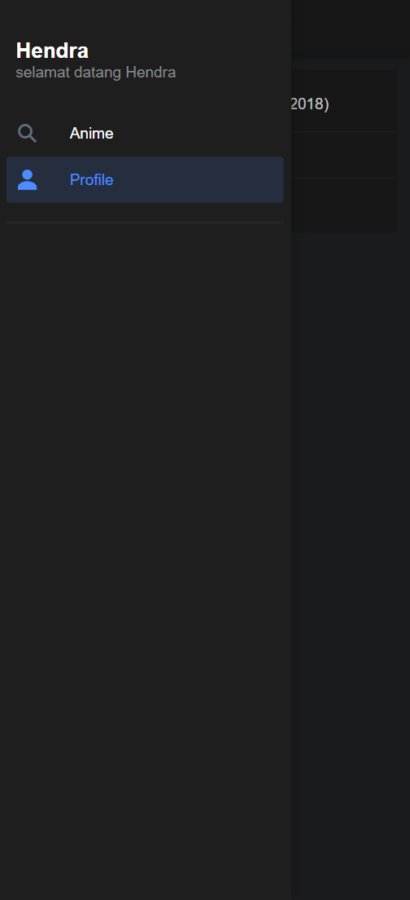
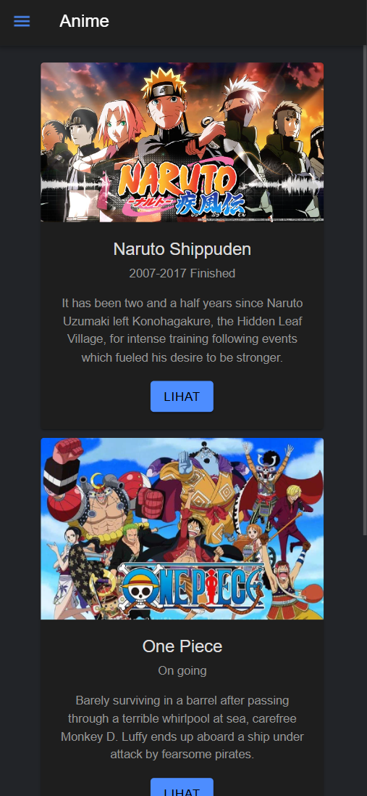
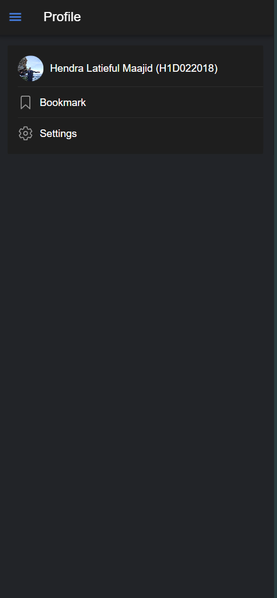

# Penjelasan Pengambilan Component Ionic
## Hendra Latieful Maajid
## H1D022018
1. Kunjungi website [ionic component](https://ionicframework.com/docs/components) 
2. Pilih Componen yang ingin kamu gunakan untuk saya sendiri menggunakan card dan list
### CARD
```html
<ion-card>
  
  <ion-card-header>
    <ion-card-title>Card Title</ion-card-title>
    <ion-card-subtitle>Card Subtitle</ion-card-subtitle>
  </ion-card-header>

  <ion-card-content>
    Here's a small text description for the card content. Nothing more, nothing less.
  </ion-card-content>
</ion-card>
```
### LIST 
```html
<ion-list>
  <ion-item>
    <ion-label>Pokémon Yellow</ion-label>
  </ion-item>
  <ion-item>
    <ion-label>Mega Man X</ion-label>
  </ion-item>
  <ion-item>
    <ion-label>The Legend of Zelda</ion-label>
  </ion-item>
  <ion-item>
    <ion-label>Pac-Man</ion-label>
  </ion-item>
  <ion-item>
    <ion-label>Super Mario World</ion-label>
  </ion-item>
</ion-list>
```

3. Ubah konten isiannya pada tiap komponen yang ingin ditambahkan 
### CARD
```html
<ion-card>
    
    <ion-card-header>
        <ion-card-title>Naruto Shippuden</ion-card-title>
        <ion-card-subtitle>2007-2017 Finished</ion-card-subtitle>
    </ion-card-header>

    <ion-card-content>
        It has been two and a half years since Naruto Uzumaki left Konohagakure, the Hidden Leaf Village, for intense training following events which fueled his desire to be stronger.
    </ion-card-content>
    <ion-button class="button-main" color="primary">lihat</ion-button>
</ion-card>
```
### LIST
```html
<ion-list [inset]="true">
    <ion-item>
        <ion-avatar>
        
        </ion-avatar>
        <ion-text>Hendra Latieful Maajid (H1D022018)</ion-text>
    </ion-item>
    <ion-item class="settings">
        <ion-icon name="bookmark-outline"></ion-icon>
        <ion-label>Bookmark</ion-label>
    </ion-item>
    <ion-item class="settings">
        <ion-icon name="settings-outline"></ion-icon>
        <ion-label>Settings</ion-label>
    </ion-item>
</ion-list>
```
4. Jalankan aplikasinya menggunakan ionic serve

## Screenshoot


